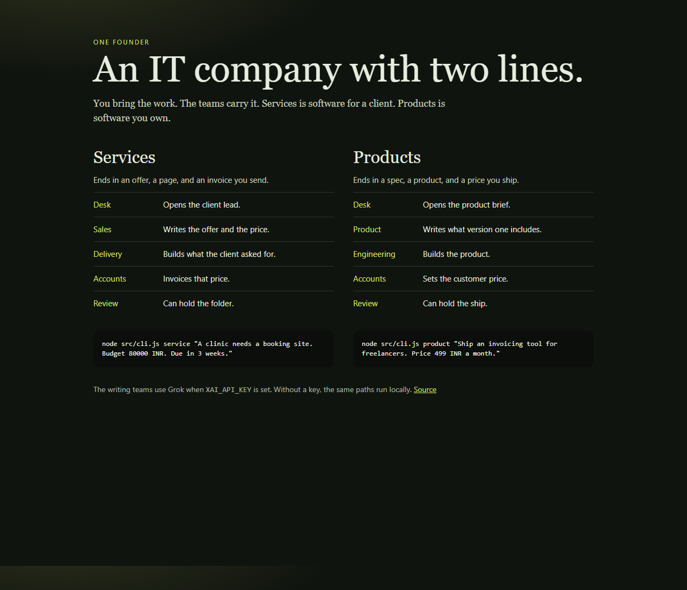

# Sole



One person runs an IT company. The teams take a job from the first reading through to a folder you can send or ship.

Sole has two lines.

## Services

Client work. A clinic, a shop, a company that wants software built for them.

| Team | What it does |
| --- | --- |
| Desk | Opens the lead and writes the handover |
| Sales | Decides if the work fits, then writes the offer |
| Delivery | Builds the client's page |
| Accounts | Writes the invoice for the offer price |
| Review | Checks the folder. Review can hold it |

```bash
node src/cli.js service "A clinic needs a booking site. Budget 80000 INR. Due in 3 weeks."
```

The folder holds the lead, the offer, the page, the review, the invoice, and the handover. The founder sends it to the client.

## Products

Software the company owns. You name the product. The teams ship version one.

| Team | What it does |
| --- | --- |
| Desk | Opens the brief and writes the handover |
| Product | Decides if it should ship, then writes the spec |
| Engineering | Builds the product page |
| Accounts | Writes the price customers pay |
| Review | Checks the folder. Review can hold the ship |

```bash
node src/cli.js product "Ship an invoicing tool for freelancers. Price 499 INR a month."
```

The folder holds the brief, the spec, the product page, the review, the price sheet, and the handover. The founder ships it.

A stated budget stays the price. "499 INR a month" is billed monthly. Work asked for at no charge is declined before anyone builds.

Review does not ask the team that wrote the page whether the page is good. The checks are in code. If the page drops the brief, or the money changes the price, the folder is held.

Both commands run with the local teams when no key is set. The folders appear under `deliveries/`.

To have Grok run the writing teams, create a key at [console.x.ai](https://console.x.ai) and set it in the same terminal:

```bash
set XAI_API_KEY=your_key
node src/cli.js service "A clinic needs a booking site. Budget 80000 INR. Due in 3 weeks."
```

On a service job, Grok is Sales, Delivery, and Accounts. On a product job, Grok is Product, Engineering, and Accounts. The model is `grok-4.7` on `https://api.x.ai/v1`. The key stays on your machine. Desk and Review stay in code either way.

## Test

```bash
npm test
```

## Author

[Sneh Dhanani](https://github.com/DhananiSneh) · [snehdhanani1@gmail.com](mailto:snehdhanani1@gmail.com)
